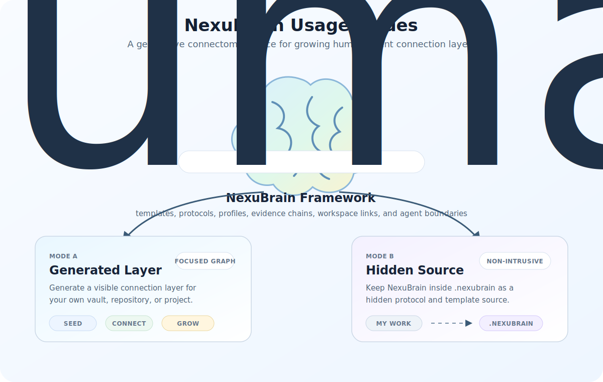
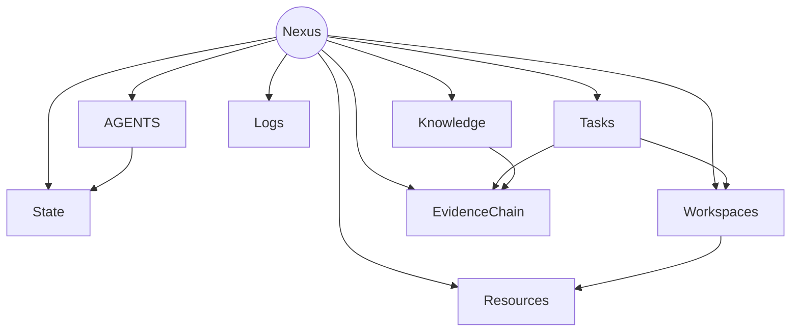

# NexuBrain

> Development preview: NexuBrain is currently being refactored as a hidden `.nexubrain/` framework source. The intended public release surface is `.nexubrain/` plus this README.

**NexuBrain is a generative cognitive connectome framework for human-agent collaborative work.**

It is not a replacement for your Obsidian vault, Git repository, research project, or local workspace. NexuBrain installs beside an existing knowledge system and helps an AI agent generate a visible connection layer for orientation, state recovery, knowledge organization, task execution, evidence tracking, workspace routing, and agent continuity.

NexuBrain was established by Dr. Tianhua Gao for research, development, writing, and long-running knowledge work with AI agents.

## Recommended Folder Shape

NexuBrain should be placed as a visible project folder inside the user's own brain or workspace. The internal `.nexubrain/` folder is intentionally hidden; agents read it, while humans normally start from `README.md` before setup. After setup, the local copy hides this README as `.README.md` so Obsidian does not treat it as a graph node.

```text
MyBrain/
|-- NexuBrain/          <- visible project folder for the user
|   |-- README.md       <- human entry point before setup; hidden as .README.md after setup
|   `-- .nexubrain/     <- hidden framework source for agents
`-- user's own knowledge-base content
```

On macOS, Finder hides files and folders whose names start with `.` by default. If `.nexubrain/` or `.README.md` is not visible after setup, that is expected; the user does not need to open them manually. Ask the local agent to read `./NexuBrain/.nexubrain/...` instead.

## What NexuBrain Generates

In a configured workspace, NexuBrain helps create a small visible layer whose filenames follow the confirmed language. In English, that visible layer may look like:

```text
Nexus.md
State/Current-Snapshot.md
State/State.md
Knowledge/Knowledge.md
Tasks/Tasks.md
Workspaces/Workspaces.md
EvidenceChain/EvidenceChain.md
Resources/Resources.md
Logs/Logs.md
AGENTS.md
```

The hidden `.nexubrain/` folder keeps framework internals, templates, profiles, installer logic, and agent protocols out of the user's main knowledge graph. Internal template names may remain canonical English, but generated visible graph nodes should not expose English `*-Index` names when a localized setup is selected.

## Core Idea

NexuBrain separates three layers:

- **Framework source:** `.nexubrain/`, the hidden source of protocols, templates, profiles, and installer guidance.
- **Generated connection layer:** the user's visible `Nexus`, state, knowledge, task, workspace, evidence, resource, log, and agent-entry nodes.
- **Human knowledge system:** the user's real vault, repository, paper project, content project, experiment folder, or workspace.



## Why A Hidden Framework Source

Opening the full framework directly inside Obsidian can pollute the graph with installer notes, templates, release checklists, and agent-maintenance material. NexuBrain keeps that material hidden in `.nexubrain/` and generates only the user-facing connection layer that belongs in the working vault or project.

This keeps the human graph readable while still giving agents a stable protocol to follow.

## Modes

### Integrate Existing Knowledge

Use integrate mode when a vault, repository, research folder, or project workspace already exists.

Integrate mode is non-destructive by default. It first writes hidden review and proposal files under `.nexubrain/integration/`. The active agent then classifies existing notes, folders, and hub links into the NexuBrain top layer without moving, deleting, or rewriting the original material.

If the target is backed up, disposable, or a copied test vault, the agent can continue in one pass after the short interview:

- create native category nodes using the confirmed language, such as task, knowledge, workspace, evidence, and resource nodes;
- clean or create the native hub so first-level routes point to the approved top-layer categories;
- append a NexuBrain Entry Flow to `AGENTS.md` so future agents know where to begin.

Without backup confirmation, integrate mode stays proposal-first and asks before visible native edits.

Existing folders, note contents, lower-level Obsidian links, and existing `AGENTS.md` rules remain user-owned material.

### Clean Start

Use start mode for a new vault, repository, project, or workspace.

Start mode generates a complete visible connection layer from the NexuBrain templates. The generated `Nexus.md` becomes the shared entry point for the human and the agent.

## Quick Start

The recommended path is conversational. The human should not need to run the installer commands manually.

Create or open a working folder for your own brain or project, for example:

```text
MyBrain/
```

NexuBrain should live inside that folder so the framework source sits beside the user's future visible connection layer. The agent can clone it for you; the target shape is:

```text
MyBrain/
`-- NexuBrain/
    `-- .nexubrain/
```

Then open `MyBrain/` in Codex, Claude Code, Cursor Agent, VS Code, or another local agent-capable environment. The important point is to open the user's working folder, not only the cloned NexuBrain source folder.

Give the agent this request:

```text
I want to configure NexuBrain for the current folder.

If NexuBrain is not already cloned here, clone
https://github.com/TianhuaGao/NexuBrain.git into ./NexuBrain.
Use ./NexuBrain/.nexubrain as the framework source.

Please read:
- ./NexuBrain/.nexubrain/core/onboarding.md
- ./NexuBrain/.nexubrain/core/modes.md
- ./NexuBrain/.nexubrain/core/protocol.md
- ./NexuBrain/.nexubrain/manifest.json

Do not ask me to run shell commands manually. First tell me NexuBrain
configuration requires a short interview before writing files. Ask only for:
language, target, mode, and whether this folder is backed up or disposable.

After language and mode are confirmed, run the write-free guide. If existing
knowledge files are detected, recommend integrate mode. If I confirm the target
is backed up, continue in one pass: generate the hidden review layer, classify
the existing graph, create the visible NexuBrain nodes, clean the native hub so
first-level routes point only to NexuBrain categories, and append the NexuBrain Entry Flow to
AGENTS.md. At the end, hide the local NexuBrain source README.md as .README.md so Obsidian does not treat it as a graph node. Do not repeatedly ask for approval between these steps.

Even in one-pass mode, do not delete, move, rename, overwrite, or rewrite
existing knowledge files. Treat destructive migration as a separate task.
```

After the short interview, the human can let the agent continue and wait for setup to finish. The agent should inspect the workspace, choose the right mode, apply the approved setup path, and then report what changed.

When setup completes, the workspace should have a visible entry point and top-level connection layer. In a clean start, this usually means `Nexus.md` plus generated folders such as `State/`, `Knowledge/`, `Tasks/`, `Workspaces/`, `EvidenceChain/`, `Resources/`, and `Logs/`. In integrate mode, NexuBrain may preserve an existing native hub instead of creating a new `Nexus.md`, but the result should still expose clear top-level routes for state, knowledge, tasks, workspaces, evidence, resources, logs, and agent rules.

For an existing knowledge base, if the human confirmed the target is backed up or disposable, the agent may complete backup-gated one-pass integrate mode: generate the hidden review layer, classify existing material, create visible native top-layer nodes, clean the native hub to those approved top-level routes, append the NexuBrain Entry Flow to `AGENTS.md`, and hide the local NexuBrain source `README.md` as `.README.md`. If backup is not confirmed, the agent should stop at proposal-first integration until the human approves visible native edits.

The command examples below are implementation notes for agents. Humans normally should not need to run them manually.

Write-free guide:

```bash
./NexuBrain/.nexubrain/installer/nexubrain-init.sh guide .
```

Backup-gated one-pass integrate mode for an existing backed-up knowledge base:

```bash
./NexuBrain/.nexubrain/installer/nexubrain-init.sh integrate . \
  --profile obsidian-vault \
  --language <language> \
  --interview-confirmed \
  --backup-confirmed \
  --hub-edit-policy one-pass-after-backup
```

Start mode for a clean new workspace:

```bash
./NexuBrain/.nexubrain/installer/nexubrain-init.sh start . \
  --profile obsidian-vault \
  --language <language> \
  --interview-confirmed
```

Use `--force` only when intentionally regenerating NexuBrain-generated files. In integrate mode without a confirmed backup, default writes stay inside `.nexubrain/integration/` and visible native changes require approval. With `--backup-confirmed --hub-edit-policy one-pass-after-backup`, the single setup approval covers additive visible nodes, top-layer-only hub cleanup, an append-only `AGENTS.md` entry flow, and hiding the local NexuBrain source README as `.README.md`.

## Generated Nexus Map

In start mode, the generated connection layer is centered on `Nexus.md`. In integrate mode, NexuBrain respects an existing native hub such as `Nexus.md`, `Hub.md`, `Home.md`, `Index.md`, or another localized entry file.



Recommended agent reading order for a generated clean-start workspace follows the configured visible paths. For English:

```text
AGENTS.md
Nexus.md
State/Current-Snapshot.md
Tasks/Tasks.md
Knowledge/Knowledge.md
Workspaces/Workspaces.md
EvidenceChain/EvidenceChain.md
```

For other languages, use the generated visible filenames recorded by the setup pass.

Recommended agent reading order after integrate mode:

```text
.nexubrain/integration/Agent-Deep-Review-Protocol.md
.nexubrain/integration/Integration-Report.md
.nexubrain/integration/Native-Top-Layer-Proposal.md
.nexubrain/integration/AGENTS-Patch-Proposal.md
```

## Main Capabilities

- Agent-led configuration interview before file generation.
- Write-free guide mode for inspecting a target workspace.
- Clean-start generation for new projects and vaults.
- Non-destructive integration for existing knowledge systems.
- Native top-layer category nodes for state, knowledge, tasks, workspaces, evidence, resources, and logs.
- Obsidian-compatible wiki-link organization without depending on Obsidian for correctness.
- Append-only `AGENTS.md` entry-flow proposal for future AI agents.
- Separation between current state, durable knowledge, actionable tasks, evidence, logs, and real workspaces.
- Hidden framework source that keeps administrative material out of the visible user graph.

## Repository Layout

Target public release layout:

```text
.
|-- .nexubrain/
|   |-- core/
|   |-- installer/
|   |-- profiles/
|   |-- templates/
|   |-- assets/
|   |-- LICENSE
|   |-- TRADEMARKS.md
|   `-- manifest.json
`-- README.md
```

Current development checkouts may also contain hidden local tooling such as `.git/`, `.gitignore`, `.obsidian/`, `.agents/`, or `.codex/`. The intended user-facing repository surface is `.nexubrain/` plus this README.

## Core Concepts

- **Cognitive connectome:** a functional connection model for human-agent work, linking state, knowledge, tasks, evidence, decisions, logs, skills, workspaces, and agent rules.
- **Nexus:** the generated central navigation entry for a clean-start connection layer. In integrate mode, existing native hub names can be preserved.
- **State:** current focus, attention, working context, decisions, risks, and next action.
- **Knowledge:** long-term semantic memory for durable concepts, facts, theories, topic notes, and domain understanding.
- **Tasks:** actionable units of work with context, execution notes, and completion criteria.
- **Workspaces:** real places where work happens, such as repositories, experiments, paper projects, data folders, or services.
- **EvidenceChain:** source-backed support for claims, experiments, code behavior, literature notes, and decisions.
- **Logs:** incremental process history, separated from current truth.
- **AGENTS entry flow:** a short local startup route that tells future agents how to enter the workspace safely.

## Who It Is For

NexuBrain is designed for researchers, developers, engineers, students, writers, and long-term knowledge workers who use AI agents for work that needs continuity across sessions.

It is especially useful when you want to connect:

- research notes and paper projects;
- code repositories and development tasks;
- experiments, evidence, and claims;
- long-running writing or content projects;
- Obsidian knowledge bases and agent workflows.

## Responsible Use

NexuBrain is intended for lawful, ethical, accountable knowledge work. Do not use it for dangerous, illegal, abusive, or unethical behavior, including weaponized harm, cyber abuse, privacy invasion, fraud, academic misconduct, credential theft, destructive automation, or attempts to evade law, policy, safety review, or accountability.

See [.nexubrain/templates/RESPONSIBLE_USE.md](.nexubrain/templates/RESPONSIBLE_USE.md) for the generated responsible-use statement.

## Framework Docs

Agent-readable framework guidance lives inside `.nexubrain/`:

- [.nexubrain/core/onboarding.md](.nexubrain/core/onboarding.md)
- [.nexubrain/core/modes.md](.nexubrain/core/modes.md)
- [.nexubrain/core/protocol.md](.nexubrain/core/protocol.md)
- [.nexubrain/core/template-contract.md](.nexubrain/core/template-contract.md)
- [.nexubrain/core/design-principles.md](.nexubrain/core/design-principles.md)
- [.nexubrain/core/cognitive-connectome-model.md](.nexubrain/core/cognitive-connectome-model.md)
- [.nexubrain/core/generative-connectome-architecture.md](.nexubrain/core/generative-connectome-architecture.md)
- [.nexubrain/core/release-layout.md](.nexubrain/core/release-layout.md)
- [.nexubrain/installer/README.md](.nexubrain/installer/README.md)

## Contributors And AI Collaboration

NexuBrain was established by Dr. Tianhua Gao with Codex as an AI collaboration partner for framework design, editing, structuring, and repository maintenance.

## License And Trademarks

NexuBrain software and documentation are released under the MIT License. See [.nexubrain/LICENSE](.nexubrain/LICENSE).

The MIT License grants copyright permissions for the software and documentation. It does not grant permission to use, register, or claim ownership of the `NexuBrain` name as a project or product brand. See [.nexubrain/TRADEMARKS.md](.nexubrain/TRADEMARKS.md).
